# Documento Obligatorio ORT - Devops Agosto 2024 - Nicolás Bañales

## 1. Introducción

Este proyecto busca implementar una solución DevOps integral para una empresa del sector retail que desea modernizar la manera en que desarrolla, prueba y despliega software. El objetivo principal es optimizar el **time-to-market** y mejorar la calidad del software mediante la adopción de prácticas de integración y entrega continua (CI/CD), junto con la gestión de la infraestructura como código (IaC).

### Objetivo General

Alojar completamente en la nube pública una solución que utilice metodologías y herramientas DevOps, maximizando la escalabilidad, eficiencia y estabilidad de las aplicaciones desplegadas.

### Objetivos Específicos

1. **Diseño de infraestructura en la nube:** Utilizar un enfoque de IaC para desplegar recursos de manera automatizada y eficiente.

2. **Implementación de CI/CD:** Configurar pipelines para los microservicios backend y el frontend, garantizando despliegues rápidos y confiables.

3. **Gestión de microservicios:** Contenerizar y orquestar los microservicios, asegurando su correcta comunicación y escalabilidad.

4. **Pruebas y análisis de calidad:** Automatizar pruebas funcionales y análisis de código estático para asegurar la calidad de los servicios.

   

## 2. Arquitectura de la Solución

### Diagrama de flujo CI/CD

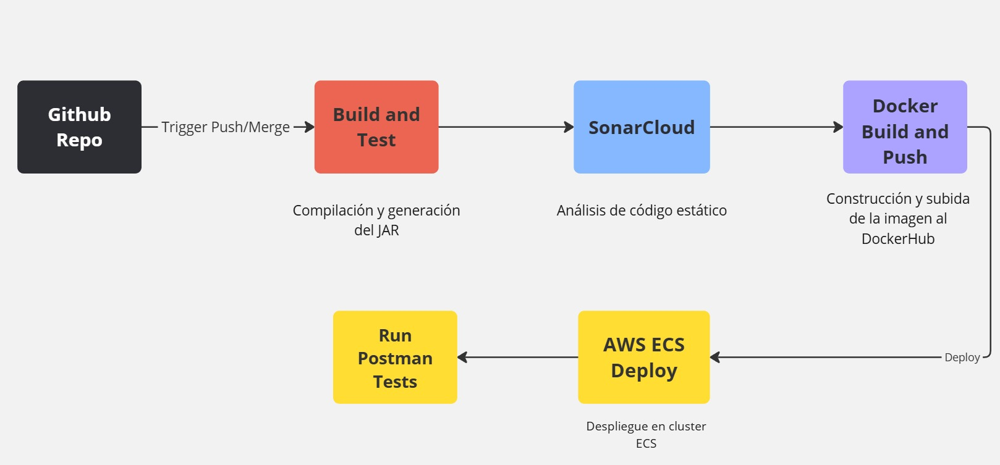

### Descripción del Flujo 

1. **Repositorio GitHub**:

   - El proceso se inicia con un **trigger** configurado en GitHub Actions, que se activa ante un evento de **push** o **merge** en las ramas monitoreadas, en mi caso main.

2. **Build and Test**:

   - En esta etapa se utiliza **Maven** para compilar el código fuente de los microservicios y generar el artefacto JAR correspondiente.
   - También se realizan los test definidos en el código para validar el funcionamiento del antes de continuar.

3. **Análisis de Código Estático (SonarCloud)**:

   - Se lleva a cabo un análisis de calidad del código con **SonarCloud**, identificando posibles vulnerabilidades, errores o malas prácticas.

4. **Docker Build and Push**:

   - Se construye una imagen Docker del microservicio utilizando el artefacto JAR generado en la etapa anterior.
   - La imagen es subida a un repositorio centralizado en **DockerHub**, etiquetada con la versión correspondiente.

5. **Despliegue en AWS ECS**:

   - La imagen Docker se despliega en un cluster configurado en **Amazon ECS**, asegurando que el servicio esté disponible para su uso en los entornos definidos.

6. **Despliegue en AWS ECS**:

   - Utilizando **Newman**, se ejecutan pruebas funcionales automatizadas para validar la correcta interacción de las APIs

     

## 3. Herramientas y Tecnologías Utilizadas

El proyecto hace uso de una combinación de herramientas modernas para garantizar la calidad del código, la eficiencia en el desarrollo y despliegue, y la estabilidad de la infraestructura. Estas herramientas fueron seleccionadas para cumplir con los requisitos del caso de estudio.

------

#### **Infraestructura como Código (IaC)**

- **Terraform** : Se utilizó para diseñar y desplegar la infraestructura en AWS. Los recursos definidos incluyen:
  - VPC, subredes, y grupos de seguridad.
  - Cluster ECS para contenerización.
  - Load Balancers para distribuir tráfico.
  - Buckets S3 para alojar la aplicación frontend y los logs del servicio serverless.

#### **Orquestación y Contenerización**

- **Docker**: Cada microservicio backend se empaquetó en una imagen Docker que se despliega en el cluster ECS.
- **AWS ECS (Elastic Container Service)**: Orquestador utilizado para manejar las tareas de los microservicios backend.

#### **Entrega e Integración Continua (CI/CD)**

- **GitHub Actions**: Incluye las siguientes etapas:
  - **Code Validation**: Análisis de código estático con **SonarCloud**.
  - **Build**: Compilación del código con **Maven**.
  - **Tests**: Pruebas funcionales con **Newman**.
  - **Deploy**: Despliegue en AWS ECS utilizando imágenes Docker.

#### **Análisis de Código**

- **SonarCloud**: Realiza análisis de código estático para identificar errores, vulnerabilidades y code smells. Los resultados se notifican como parte del flujo CI/CD.

#### **Gestión de Contenedores**

- **Docker Hub**: Almacena y distribuye las imágenes de contenedores etiquetadas con las versiones más recientes.

#### **Monitoreo y Automatización Serverless**

- **AWS Lambda**: Se implementó una función serverless para monitorear los servicios backend y generar logs.
- **CloudWatch**: Configurado para ejecutar la Lambda periódicamente (cada 5 minutos) mediante reglas de eventos.

#### **Frontend**

- **AWS S3**: La aplicación frontend está alojada como un sitio web estático utilizando un bucket S3 configurado para acceso público.

## 4. Demostración de Componentes y Procesos

#### Gestión del Proyecto: Tablero Kanban

Como parte de la planificación y seguimiento de las tareas, se implementó un tablero Kanban en Trello para gestionar el trabajo del proyecto. Este tablero permitió visualizar el progreso de las tareas, organizar las actividades por categorías y priorizar las entregas.

Link al tablero: https://trello.com/b/DAmeAsRF/devopsagostodiciembre2024nicolasbanales

**Evidencia:**

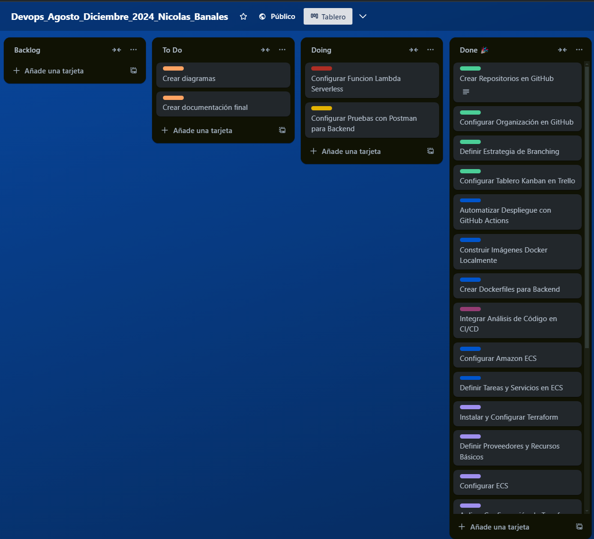

#### **Análisis de Código Estático**

- **Descripción:** Se utiliza **SonarCloud** para realizar un análisis exhaustivo del código fuente.

- **Evidencia:**

  - Captura del dashboard de análisis de los microservicios y la aplicación front-end.

  - Indicadores de calidad como cobertura de pruebas, deuda técnica, y errores críticos.

    

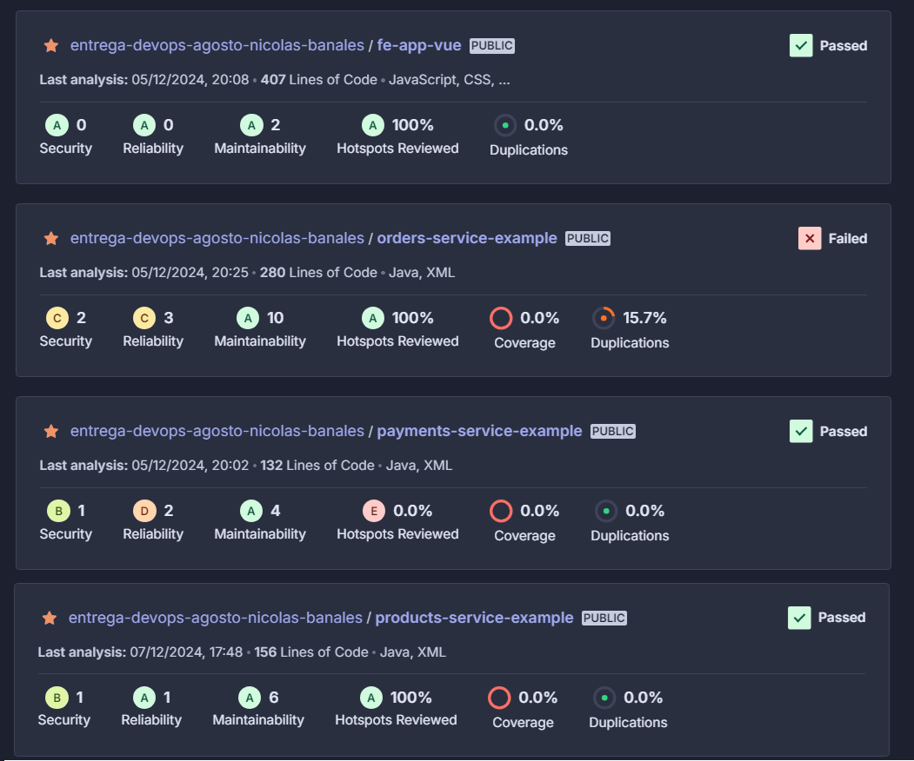

#### **Pipeline CI/CD**

**Descripción:** El pipeline definido en `backend-ci-cd.yml` automatiza los procesos de construcción, prueba y despliegue. Está compuesto por las siguientes etapas:

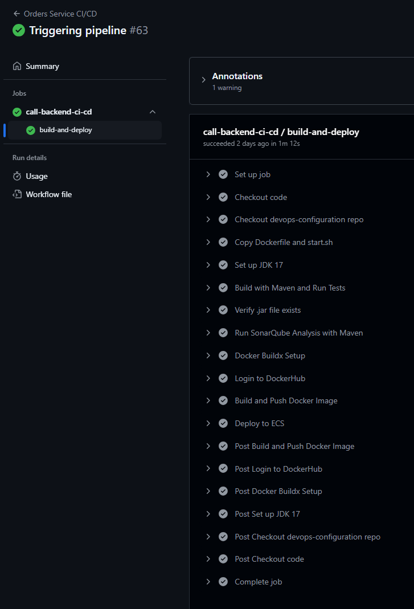

#### Iac

**Descripción:** La infraestructura está diseñada utilizando Terraform y alojada en AWS. Incluye componentes como:

- Clusters ECS para backend.
- Buckets S3 para frontend.
- Load Balancers para distribución de tráfico.

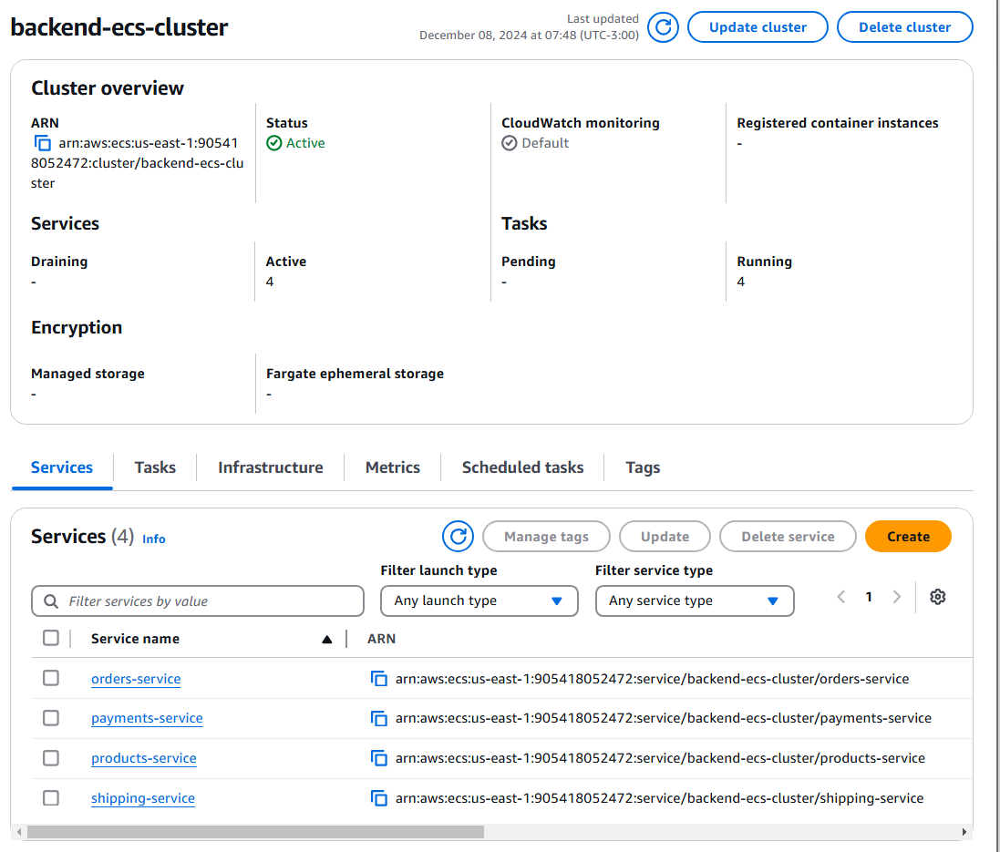

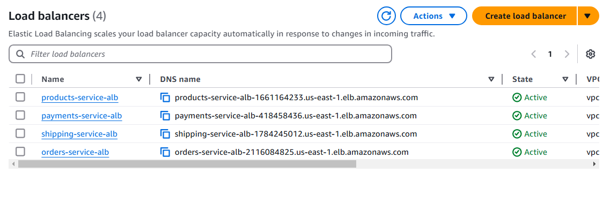

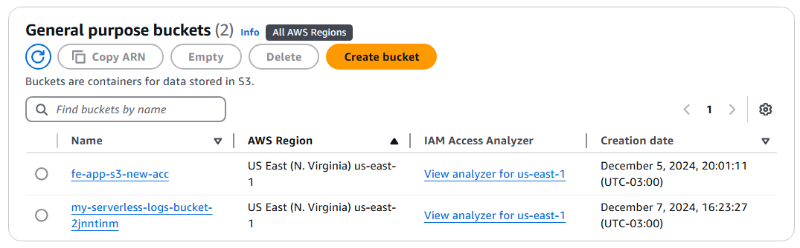

####  Imágenes Docker en DockerHub

**Descripción:** Las imágenes de los microservicios backend se construyen y publican en DockerHub como parte del pipeline CI/CD. Cada imagen está etiquetada con el hash del commit y la versión `latest` .

**Evidencia:**

- Listado de imágenes publicadas con sus tags (`latest`, `commit-hash`) en DockerHub.

  

  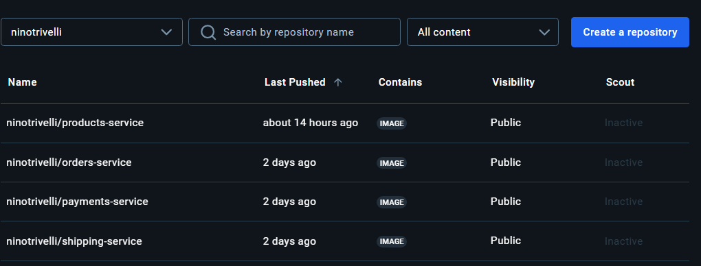

  

#### **Alojamiento del Frontend**

- **Descripción:** La aplicación frontend está alojada en un bucket S3 configurado como un sitio web estático. El bucket tiene políticas específicas para permitir acceso público.

- **Evidencia**:

  

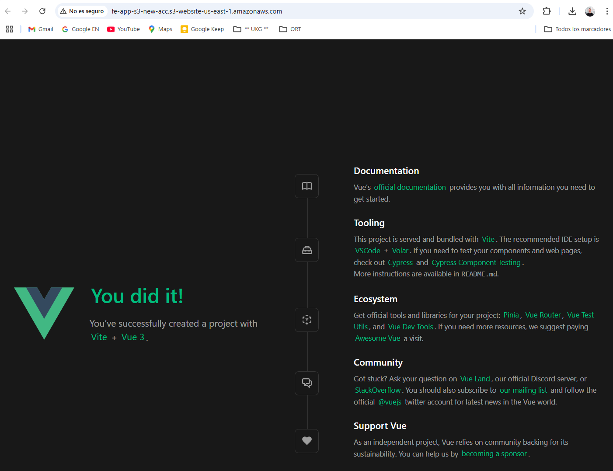

#### **Monitoreo y Automatización Serverless**

- **Descripción:** Una función Lambda monitorea los servicios backend cada 5 minutos. Se registran los resultados en un bucket S3 configurado para almacenamiento seguro.
- **Evidencia**:
  - Logs generados en S3.

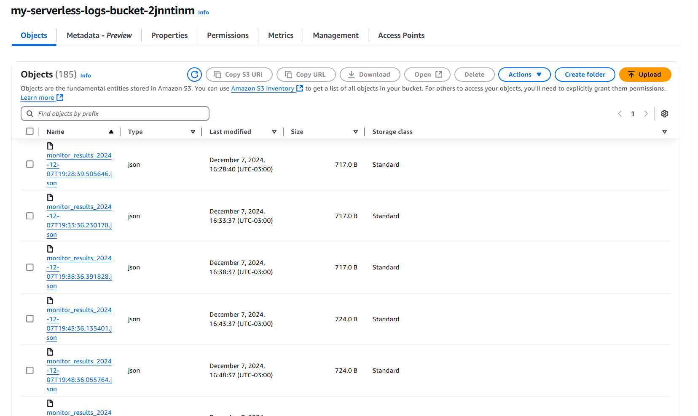

## 4. Estrategia de Branching para los Microservicios

Para organizar el código y facilitar futuras mejoras en el desarrollo de los microservicios backend, se adoptó una estrategia básica que sigue los principios iniciales de **GitFlow**, adaptada a las necesidades y el alcance del proyecto actual. Aunque todo el desarrollo y despliegue se realizó directamente en la rama principal (`main`), se crearon ramas adicionales para reflejar el formato y estructura de un flujo de trabajo más robusto.

------

#### **Ramas Implementadas**

1. **Rama Principal (`main`)**
   - Esta rama contiene el código listo para producción y fue utilizada como el punto central para los despliegues de los microservicios.
2. **Rama de Desarrollo (`develop`)**
   - Creada como preparación para seguir la estrategia de **GitFlow** en futuras iteraciones del proyecto.
   - En esta fase inicial, no se integraron cambios en esta rama, pero está configurada para servir como base para futuras características.
3. **Ramas de Características (`feature/<nombre>`)**
   - Se creó una rama de ejemplo `feature/test-branch`.) para demostrar el uso de ramas de características y probar el flujo de trabajo.
   - Aunque no se utilizó para desarrollo activo, establece las bases para futuras colaboraciones y ciclos de mejora.

## 6. Flujo y Estructura de Carpetas

#### 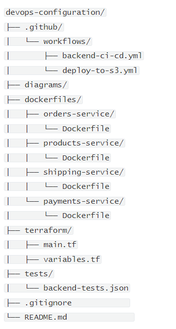

Cada microservicio backend implementa un pipeline de CI/CD definido en un archivo `ci-cd.yml` dentro de su propio repositorio. Este archivo actúa como un punto de entrada que invoca el flujo principal `backend-ci-cd.yml` ubicado en el repositorio **devops-configuration**. El flujo principal maneja todas las etapas de CI/CD, incluyendo la validación de código, construcción de artefactos, pruebas, contenerización y despliegue.

------

#### **Estructura de Carpetas**

La estructura del repositorio **devops-configuration** está diseñada para mantener la modularidad y facilitar la reutilización de configuraciones y archivos. A continuación, se describe cada directorio:

## 7. Gestión del Proyecto y Limitaciones

Debido a las limitaciones de tiempo personales en la entrega del proyecto, se optó por priorizar las tareas esenciales para completar los objetivos principales. La estrategia adoptada permitió enfocar esfuerzos en la configuración de la infraestructura, el diseño del pipeline CI/CD, y la implementación de los microservicios y el frontend en un único ambiente.

#### **Limitaciones Técnicas y de Tiempo**

1. **Despliegue en Ambientes Múltiples**:
   - El requerimiento inicial planteaba la necesidad de desplegar los servicios en tres ambientes separados: **Dev**, **Test**, y **Prod**.
   - Por razones de tiempo, el despliegue fue realizado únicamente en un ambiente consolidado, el cual incluyó:
     - Un único cluster ECS con todos los microservicios backend.
     - La aplicación frontend alojada en un bucket S3.
2. **Escalabilidad del Despliegue**:
   - Aunque la infraestructura diseñada soporta el despliegue en múltiples ambientes, no se alcanzó a realizar la réplica de configuraciones para cada uno debido a la carga de trabajo en las etapas iniciales.
3. **Otras Limitaciones Menores**:
   - La configuración actual del pipeline CI/CD no considera una calidad mínima obligatoria en SonarCloud para aprobar un cambio, pero se notifican los resultados para seguimiento.

------

A pesar de estas limitaciones, los objetivos generales del proyecto fueron cumplidos, y se logró implementar una solución funcional que incorpora las mejores prácticas DevOps y herramientas modernas de automatización.
